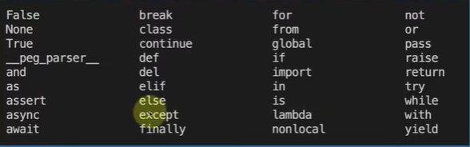

# **Las Palabras Reservadas**

## **¿Qué Son Las Palabras Reservadas En Python?**

    

**DIFINICIÓN DE PALABRAS RESERVADAS EN PYTHON:**

Las palabras reservadas en Python son términos especiales (`keywords`) con significado predefinido que **no pueden usarse como identificadores, nombres de variables, funciones o clases**. Comprenden conceptos clave como `if`, `else`, `def`, `class`, `import`, `True`, `False` y `None`, formando la estructura fundamental del lenguaje. 

**Características Clave**

* **No se pueden usar:** Intentar usar estas palabras como nombres de variables provoca un error de sintaxis.
* **Sensibles a mayúsculas:** Python diferencia entre mayúsculas y minúsculas; True es una palabra reservada, pero true no lo es.
* **Identificación:** Generalmente, los editores de código (IDEs) resaltan estas palabras en un color diferente. 

Se pueden consultar todas las palabras reservadas en cualquier momento usando el comando help("keywords") en el intérprete de Python.

 

| Keyword          | Definición                                                   | Ejemplo                          |
| ---------------- | ------------------------------------------------------------ | -------------------------------- |
| `False`          | Valor booleano falso.                                        | `activo = False`                 |
| `None`           | Representa la ausencia de valor.                             | `resultado = None`               |
| `True`           | Valor booleano verdadero.                                    | `activo = True`                  |
| `__peg_parser__` | Uso interno del parser PEG de Python (no se usa comúnmente). | *(Uso interno del intérprete)*   |
| `and`            | Operador lógico “y”.                                         | `if x > 0 and y > 0:`            |
| `as`             | Alias para módulos o excepciones.                            | `import math as m`               |
| `assert`         | Verifica una condición; lanza error si es falsa.             | `assert edad > 0`                |
| `async`          | Define funciones asincrónicas.                               | `async def cargar_datos():`      |
| `await`          | Espera el resultado de una función asincrónica.              | `datos = await cargar_datos()`   |
| `break`          | Sale de un bucle.                                            | `if x == 5: break`               |
| `class`          | Define una clase.                                            | `class Persona:`                 |
| `continue`       | Salta a la siguiente iteración del bucle.                    | `if x < 0: continue`             |
| `def`            | Define una función.                                          | `def saludar():`                 |
| `del`            | Elimina una variable o elemento.                             | `del lista[0]`                   |
| `elif`           | Condición adicional en una estructura `if`.                  | `elif edad < 18:`                |
| `else`           | Alternativa si no se cumple ninguna condición previa.        | `else: print("Mayor de edad")`   |
| `except`         | Maneja excepciones en bloques `try`.                         | `except ValueError:`             |
| `finally`        | Código que se ejecuta siempre al final de `try`.             | `finally: cerrar_archivo()`      |
| `for`            | Bucle que itera sobre una secuencia.                         | `for i in range(5):`             |
| `from`           | Importa partes específicas de un módulo.                     | `from math import pi`            |
| `global`         | Declara una variable como global.                            | `global contador`                |
| `if`             | Evalúa una condición lógica.                                 | `if edad > 18:`                  |
| `import`         | Importa módulos.                                             | `import os`                      |
| `in`             | Verifica pertenencia en una secuencia.                       | `if "a" in lista:`               |
| `is`             | Compara identidad de objetos.                                | `if x is None:`                  |
| `lambda`         | Define funciones anónimas.                                   | `f = lambda x: x * 2`            |
| `nonlocal`       | Declara variables en ámbitos externos (no globales).         | `nonlocal contador`              |
| `not`            | Operador lógico de negación.                                 | `if not activo:`                 |
| `or`             | Operador lógico “o”.                                         | `if x < 0 or y < 0:`             |
| `pass`           | No ejecuta ninguna acción (marcador).                        | `def vacia(): pass`              |
| `raise`          | Lanza una excepción.                                         | `raise ValueError("Error")`      |
| `return`         | Devuelve un valor desde una función.                         | `return resultado`               |
| `try`            | Ejecuta código que puede producir errores.                   | `try: abrir_archivo()`           |
| `while`          | Bucle que se ejecuta mientras una condición sea verdadera.   | `while x < 10:`                  |
| `with`           | Maneja contextos (archivos, recursos).                       | `with open("archivo.txt") as f:` |
| `yield`          | Devuelve valores desde una función generadora.               | `yield elemento`                 |

## AQUÍ NO LAS DEFINIREMOS TODAS, A MEDIDA QUE AVANCE EL CURSO IREMOS DEFINIENDO CADA UNA A SUVEZ LLEVANDOLA A LA PRACTICA SEGÚN CORRESPONDA 

 

## **CLASIFICACIÓN DE LAS KEYWORDS INTEGRADAS DE PYTHON**

1️⃣ Valores y constantes especiales

Representan valores predefinidos del lenguaje.

| Keyword | Función                  |
| ------- | ------------------------ |
| `True`  | Valor booleano verdadero |
| `False` | Valor booleano falso     |
| `None`  | Ausencia de valor        |

 

2️⃣ Operadores lógicos

Se usan para construir expresiones booleanas.

| Keyword | Función           |
| ------- | ----------------- |
| `and`   | Conjunción lógica |
| `or`    | Disyunción lógica |
| `not`   | Negación lógica   |

 

3️⃣ Control de flujo (decisiones y bucles)

Controlan el orden de ejecución del programa.

| Keyword    |
| ---------- |
| `if`       |
| `elif`     |
| `else`     |
| `for`      |
| `while`    |
| `break`    |
| `continue` |
| `pass`     |

 

4️⃣ Definición de estructuras

Permiten crear funciones, clases y expresiones especiales.

| Keyword  | Uso                |
| -------- | ------------------ |
| `def`    | Definir funciones  |
| `class`  | Definir clases     |
| `lambda` | Funciones anónimas |
| `return` | Retornar valores   |
| `yield`  | Generadores        |

 

5️⃣ Manejo de excepciones

Controlan errores y flujos excepcionales.

| Keyword   |
| --------- |
| `try`     |
| `except`  |
| `finally` |
| `raise`   |
| `assert`  |

 

6️⃣ Importación y módulos

Gestionan la carga de módulos y nombres.

| Keyword  |
| -------- |
| `import` |
| `from`   |
| `as`     |

 

7️⃣ Ámbito y alcance de variables

Controlan el alcance de las variables.

| Keyword   |
| --------- |
| `global`  |
| `nonlocal`|

 

8️⃣ Asincronía (programación concurrente)

Usadas en programación asíncrona ( asyncio).

| Keyword   |
| --------- |
| `async`   |
| `await`   |

9️⃣ Contextos y recursos

Manejo seguro de recursos (archivos, cerraduras, etc.).

| Keyword   |
| --------- |
| `with`    |

 

🔟 Identidad y pertenencia

Comparaciones especiales.

| Keyword |
| ------- |
| `is`    |
| `in`    |

 

1️⃣1️⃣ Internas del lenguaje

Reservadas para uso interno del intérprete.

| Keyword          |
| ---------------- |
| `__peg_parser__` |

  

# 📚 Bibliografía completa (fuentes oficiales de Python)

Python 3 – Flujo de control (si, para, mientras, romper, continuar, pasar) 
https://docs.python.org/3/tutorial/controlflow.html

Python 3 – Tipos integrados: list (métodos de listas) 
https://docs.python.org/3/library/stdtypes.html#list

Python 3 – Tipos integrados: dict (métodos de diccionarios) 
https://docs.python.org/3/library/stdtypes.html#mapping-types-dict

Python 3: Operadores aritméticos y conversiones 
https://docs.python.org/3/reference/expressions.html#arithmetic-conversions

Python 3 – Operaciones booleanas (y, o, no) 
https://docs.python.org/3/reference/expressions.html#boolean-operations

Python 3: Operaciones de membresía e identidad (en, es) 
https://docs.python.org/3/reference/expressions.html#membership-test-operations

Python 3 – Declaraciones de asignación aumentadas ( +=, -=) 
https://docs.python.org/3/reference/simple_stmts.html#augmented-assignment-statements

Python 3: declaraciones simples (importación, desde, global, no local) 
https://docs.python.org/3/reference/simple_stmts.html

Python 3 – Sentencias compuestas (def, class, try, with, async) 
https://docs.python.org/3/reference/compound_stmts.html

Python 3: Manejo de errores y excepciones 
https://docs.python.org/3/tutorial/errors.html

Python 3 – Constantes ( True, False, None) 
https://docs.python.org/3/library/constants.html

Python 3 – Palabras clave (lista oficial de palabras reservadas) 
https://docs.python.org/3/reference/lexical_analysis.html#keywords

Preguntas frecuentes sobre Python: ¿Por qué Python no tiene ++ ni --? 
https://docs.python.org/3/faq/design.html#why-doesn-t-python-have-increment-and-decrement-operators

Referencia del lenguaje Python: modelo de datos (orden de dict) 
https://docs.python.org/3/reference/datamodel.html#dict

PEP 20 – El Zen de Python 
https://peps.python.org/pep-0020/

